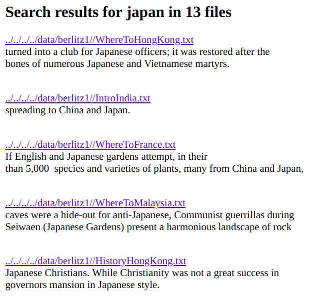

# Search Engine
Implement linear search, hashtable with Python dict, own hashtable

The data used comes from [Slate](https://github.com/parrt/msan692/blob/master/data/slate.7z) magazine and [Berlitz](https://github.com/parrt/msan692/blob/master/data/berlitz1.7z) travelogues.

# Tutorial

Simply run ``python search.py <method> <path to data source>`` where method can be
``linear``, ``index``, or ``myhtable``, which represent linear search, hashtable with Python dictionaries, and a self-implemented hashtable, respectively.

# Output

Searching for Japan in the Berlitz dataset gives the following output:

